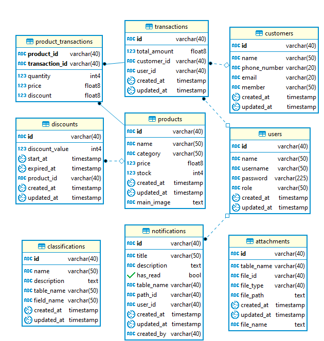

# 🛍️ Tokomart Backend

Tokomart adalah aplikasi backend untuk sistem e-commerce yang memungkinkan pengguna melakukan transaksi kasir, 
manajemen produk, manajemen customer, manajemen discount dan notifikasi.

## 🚀 Fitur
- Manajemen produk (CRUD)
- Manajemen customer (CRUD)
- Manajemen discount (CRUD)
- Manajemen pengguna & otentikasi JWT
- Sistem transaksi dan pembayaran
- Notifikasi real-time
- API berbasis RESTful

## 🛠️ Teknologi yang Digunakan
- **Backend:** .NET 9 
- **Database:** PostgreSQL 
- **Autentikasi:** JWT (JSON Web Token)
- **API Docs:** Scalar

## 📌 Cara Instalasi

1.  **Persiapan Database:**
    * Pastikan PostgreSQL terinstal.
    * Buat database "tokomart".
    * Impor `database/tokomart.sql`.
2.  **Jalankan Aplikasi:**
    * Buka proyek di Visual Studio.
    * Pastikan .NET 9 SDK terinstal.
    * Klik "Build" lalu "Debug".
3.  **Akses Aplikasi:**
    * Buka `http://localhost:5053/scalar` untuk dokumentasi API.

## 📃 Struktur Database

Berikut adalah Entity-Relationship Diagram (ERD) dari database Tokomart:

## 📃 Dokumentasi API

Dokumentasi API tersedia melalui Scalar. Setelah aplikasi dijalankan, Kemudian mengaksesnya di:

-   `http://localhost:5053/scalar`

Scalar akan menampilkan daftar endpoint API, metode, parameter, dan skema respons.
